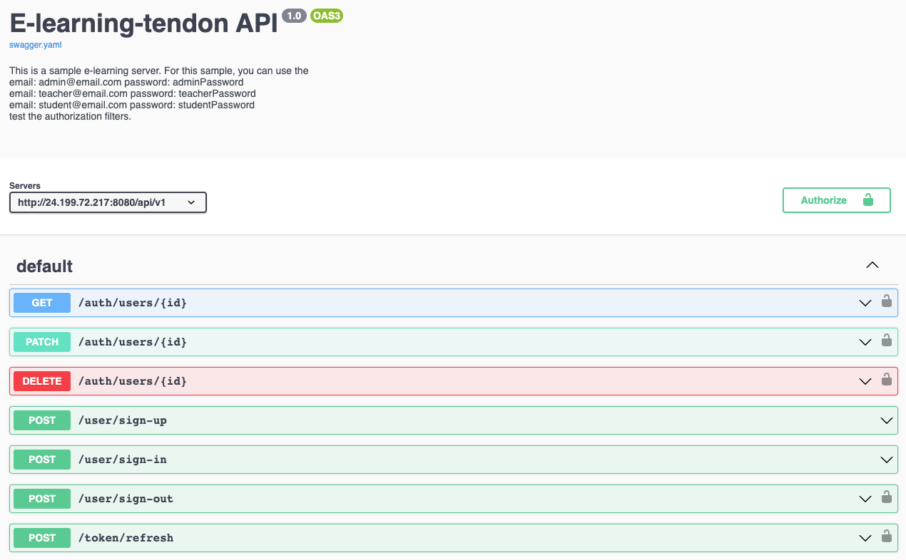

# E-learning-tendon
This is part of an e-learning project. That I work with my friend to build an e-learning platform that visualizes learning paths by course map.

## Features

- [X] Role based authentication
- [X] Documentation API with OpenAPI & Swagger
- [X] Easy to deploy by docker compose

## Backend Stack

- Go
- Gin
- MongoDB

## Try API without any installation by swagger UI : [click](http://24.199.72.217)

## if you want to run it on your machine
- create a config.yaml file(you can see config_test.yaml for example)
- run docker compose

## Frontend Repo 
Not my part, But you can see it in : [tendon-again](https://github.com/JinDamanee2544/tendon-again)

